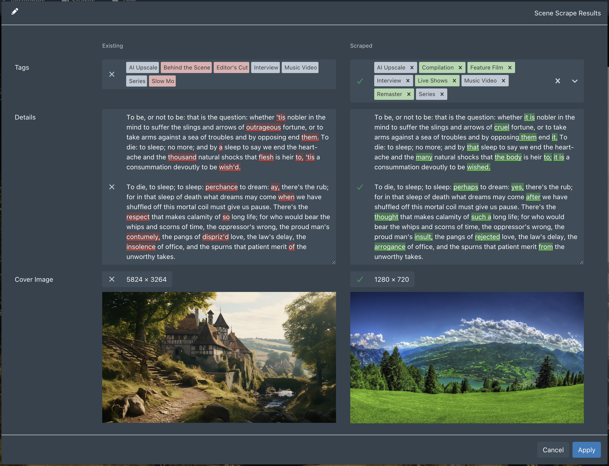

# ScrapeLens

Highlights what changed between your existing data and the scraped result in Stash scrape result modals — word-level diff on Details/Synopsis text, added/removed color coding on tags, and image resolution display next to accept/reject buttons.

## Features

- Word-level diff with red (removed) and green (added) highlights on Details/Synopsis
- Tag diff highlighting — removed tags turn red, added tags turn green
- Image resolution (W × H) shown next to accept/reject buttons for scene cover, group front/back, and performer images
- Works across Scene, Gallery, Performer, and Group scrape modals
- Synchronized height resize — drag either textarea and the other follows
- Live updates as you edit the scraped field
- No external dependencies, no build step

## Installation

### Via Stash (recommended)

1. Go to **Settings → Plugins → Available Plugins**
2. Click **Add Source** and fill in:
   - **Name:** anything you like (e.g. `rchrdcho`)
   - **Source URL:** `https://rchrdcho.github.io/StashPlugins/main/index.yml`
3. Find **ScrapeLens** in the list, check the box, and click **Install**
4. Click **Reload Plugins**
5. Refresh the page

### Manual install

1. Clone this repository, or download it as a ZIP and unzip it
2. Copy the `ScrapeLens` folder into your Stash plugins directory (default: `~/.stash/plugins/`)
3. Go to **Settings → Plugins** and click **Reload Plugins**
4. Refresh the page

## Usage

Open any scrape result modal. The Details/Synopsis field will display a word-level diff, the Tags field will highlight which tags are new or removed, and image fields will show the resolution of each image next to the accept/reject button.

No configuration required.

## Notes

- Skips the Details/Synopsis and Tags diff when the existing field is empty (new data, nothing to diff against)
- Performer image carousel updates the resolution display as you navigate between images
- Cleans up all event listeners and observers when the modal closes
